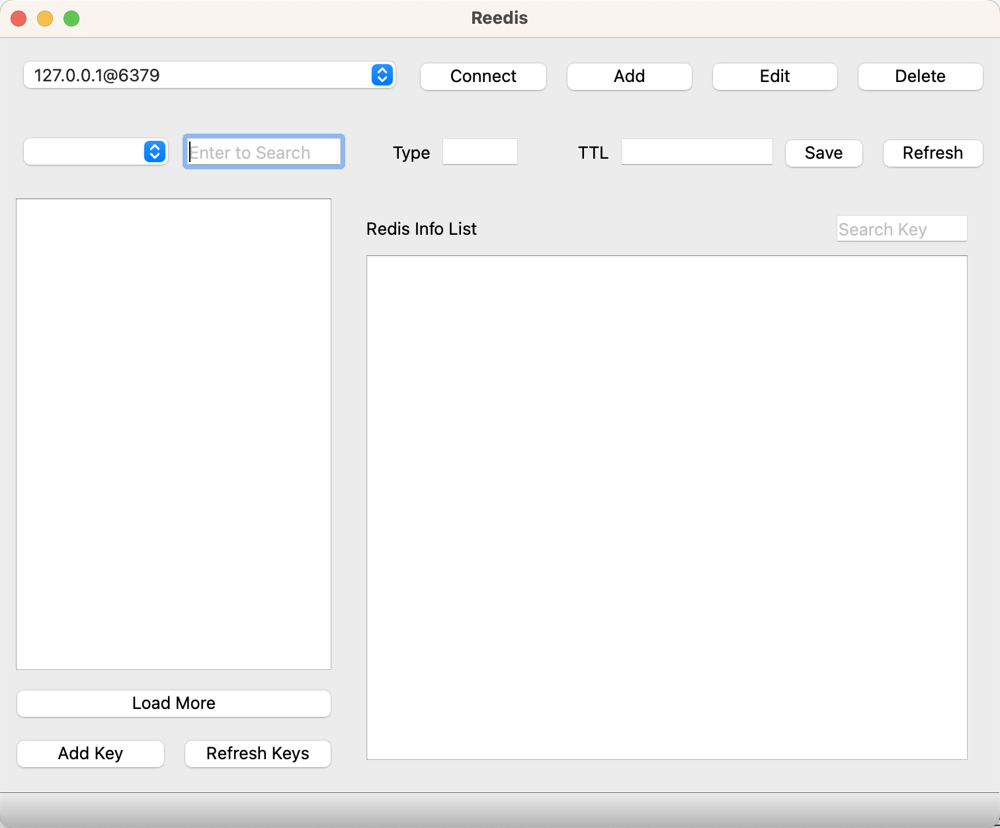
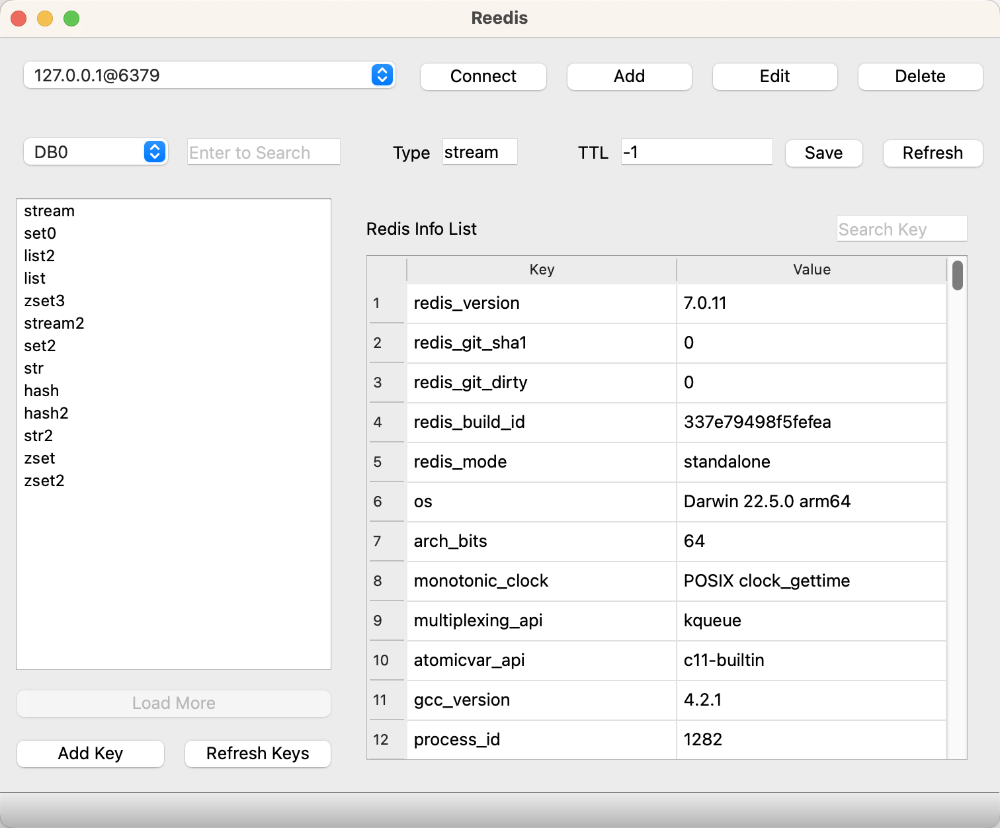
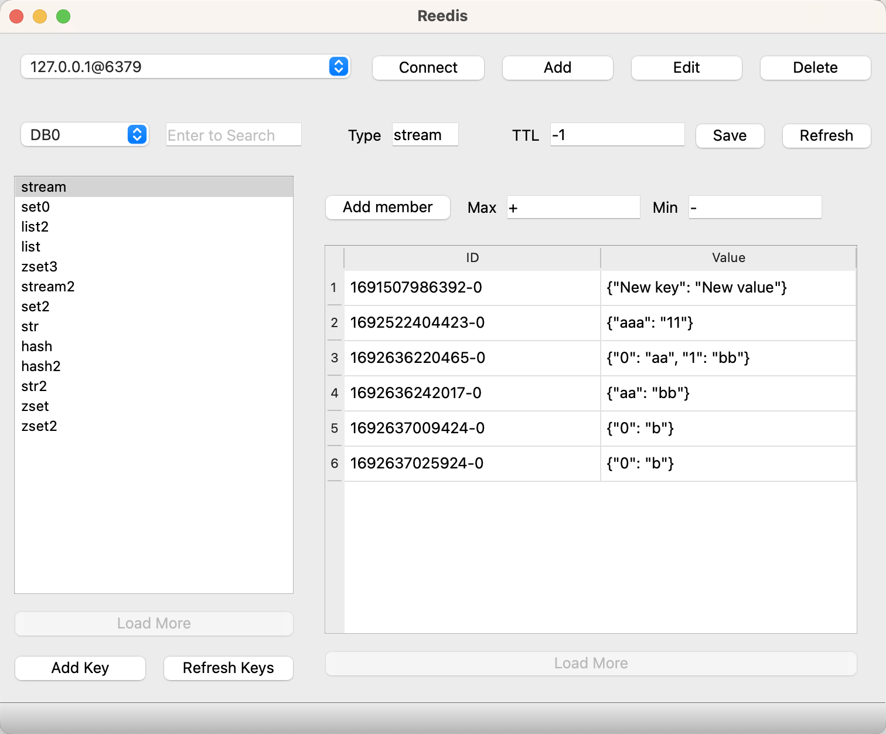
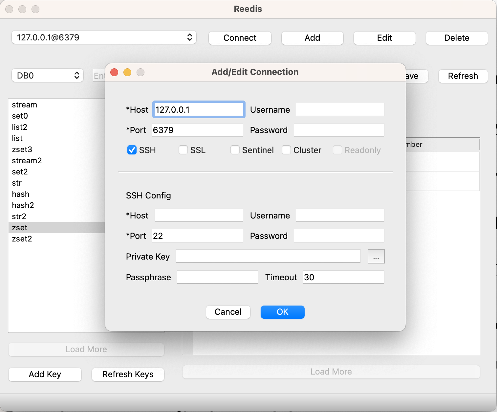

# Reedis

(Forgive me for designing this ugly logo by myself.) 

Redis GUI for Django user

## Purpose

I am using Django to build a web service involving Redis as the cache server. 

But after saving the content into Redis, I can't easily read from the Redis string because Django serializes data with `pickle`. 

So I pop up with an idea to build a Redis GUI for a Django user like me.

## Structure

mainly with `QT Pyside6` + `SQLAlchemy` + `redis-py`

## Support Feature

1. Redis connection management (Add, Delete, Edit)
2. Data type support: string, list, hash, set, zset, stream
3. Key management (Add, Delete, Rename)
4. Content management (Add, Delete, Edit, Copy)
5. String content format: raw string, Json, Django pickle

## Need Tested Feature

- [x] Redis Connection with SSH
- [ ] Redis Connection with SSL
- [ ] Redis Connection with Sentinel
- [ ] Redis Connection with Cluster

## TODO List

- [ ] Build package for Windows and Linux
- [ ] Support open multi connections at some time
- [ ] Add more basic setting 
- [ ] GUI upgrade ( maybe add theme? )
- [ ] TBD

## Thanks

GUI design inspire by [AnotherRedisDesktopManager](https://github.com/qishibo/AnotherRedisDesktopManager)

## LICENSE

LGPL
